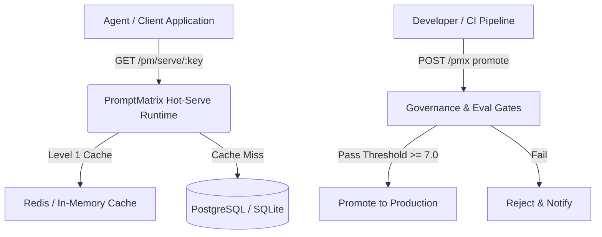

# PromptMatrix Documentation 📚

Welcome to the PromptMatrix technical documentation. PromptMatrix is open-source governance infrastructure for AI applications and agent swarms.

> 🌐 **Interactive OpenAPI Portal**: Explore and test all 44 endpoints live at [promptmatrix.site/docs/](https://promptmatrix.site/docs/).

---

## Documentation Index

- [Architecture & Design](ARCHITECTURE.md) — System design, hot-serve runtime, evaluation gates, and persistence models.
- [API Reference](API_REFERENCE.md) — REST API endpoints for prompts, versions, environments, serve, and evals.
- [Python SDK Guide](SDK_GUIDE.md) — Zero-dependency Python client library (`promptmatrix-sdk`).
- [CLI Reference](CLI_GUIDE.md) — Command-line interface (`pmx`) for local management and CI/CD pipelines.
- [OpenAPI Specification](openapi.json) — Full OpenAPI 3.1 JSON schema.

---

## Quick Navigation

